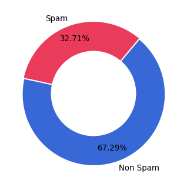

# Spam Ham Email Classification using Naive Bayes Classifier
Email classification that distinguishes between Spam and Non-Spam emails is a great use case of NLP and ML Classification. To classify emails into Spam and Non-Spam, they are transformed(pre-processed) using various NLP techniques into usable format and then ML algorithm is applied on them. 

## Project Description: 
In this project, I will be creating a Naive Bayes model that will classify Spam and Non-Spam(Ham) emails. 
In this file, I will be preprocessing the text emails. 


```python
import numpy as np
import pandas as pd
from os import walk
from os.path import join
from nltk.stem import PorterStemmer

from sklearn.feature_extraction.text import CountVectorizer
from sklearn.model_selection import train_test_split
from sklearn.naive_bayes import MultinomialNB
from sklearn.metrics import precision_recall_fscore_support
from sklearn.feature_extraction.text import TfidfVectorizer
from sklearn.ensemble import RandomForestClassifier
import nltk
from nltk.stem import WordNetLemmatizer
from sklearn.metrics import classification_report, confusion_matrix, accuracy_score
from sklearn.svm import SVC
from xgboost import XGBClassifier
from sklearn.metrics import roc_curve, roc_auc_score

import re

from bs4 import BeautifulSoup
import matplotlib.pyplot as plt

```


```python
Data_JSON_Path = 'SpamData/01_Processing/email-text-data 3.json'

#Email corpus file path are mentioned below
Spam_1_Path = 'SpamData/01_Processing/spam_assassin_corpus/spam_1'
Spam_2_Path = 'SpamData/01_Processing/spam_assassin_corpus/spam_2'
Easy_Ham1_Path = 'SpamData/01_Processing/spam_assassin_corpus/easy_ham_1'
Easy_Ham2_Path = 'SpamData/01_Processing/spam_assassin_corpus/easy_ham_2'

Data_JSON_Path = 'SpamData/01_Processing/email-text.json'

Spam_Class = 1
Ham_Class = 0
```

## Data:
The data is gathered from https://spamassassin.apache.org/old/publiccorpus/   
This is an open source project by Apache called SpamAssassin. I have downloaded the latest version(date) of the data.   

Let us explore the data a bit.


```python
#Opening a file. The path is saved in constant Sample_File.
stream = open("SpamData/01_Processing/practice_email.txt", encoding='utf-8')
#Here the encoding is utf-8 or unicode encoding. 
msg = stream.read()
stream.close()
print(msg)
```

    From exmh-workers-admin@redhat.com  Thu Aug 22 12:36:23 2002
    Return-Path: <exmh-workers-admin@spamassassin.taint.org>
    Delivered-To: zzzz@localhost.netnoteinc.com
    Received: from localhost (localhost [127.0.0.1])
    	by phobos.labs.netnoteinc.com (Postfix) with ESMTP id D03E543C36
    	for <zzzz@localhost>; Thu, 22 Aug 2002 07:36:16 -0400 (EDT)
    Received: from phobos [127.0.0.1]
    	by localhost with IMAP (fetchmail-5.9.0)
    	for zzzz@localhost (single-drop); Thu, 22 Aug 2002 12:36:16 +0100 (IST)
    Received: from listman.spamassassin.taint.org (listman.spamassassin.taint.org [66.187.233.211]) by
        dogma.slashnull.org (8.11.6/8.11.6) with ESMTP id g7MBYrZ04811 for
        <zzzz-exmh@spamassassin.taint.org>; Thu, 22 Aug 2002 12:34:53 +0100
    Received: from listman.spamassassin.taint.org (localhost.localdomain [127.0.0.1]) by
        listman.redhat.com (Postfix) with ESMTP id 8386540858; Thu, 22 Aug 2002
        07:35:02 -0400 (EDT)
    Delivered-To: exmh-workers@listman.spamassassin.taint.org
    Received: from int-mx1.corp.spamassassin.taint.org (int-mx1.corp.spamassassin.taint.org
        [172.16.52.254]) by listman.redhat.com (Postfix) with ESMTP id 10CF8406D7
        for <exmh-workers@listman.redhat.com>; Thu, 22 Aug 2002 07:34:10 -0400
        (EDT)
    Received: (from mail@localhost) by int-mx1.corp.spamassassin.taint.org (8.11.6/8.11.6)
        id g7MBY7g11259 for exmh-workers@listman.redhat.com; Thu, 22 Aug 2002
        07:34:07 -0400
    Received: from mx1.spamassassin.taint.org (mx1.spamassassin.taint.org [172.16.48.31]) by
        int-mx1.corp.redhat.com (8.11.6/8.11.6) with SMTP id g7MBY7Y11255 for
        <exmh-workers@redhat.com>; Thu, 22 Aug 2002 07:34:07 -0400
    Received: from ratree.psu.ac.th ([202.28.97.6]) by mx1.spamassassin.taint.org
        (8.11.6/8.11.6) with SMTP id g7MBIhl25223 for <exmh-workers@redhat.com>;
        Thu, 22 Aug 2002 07:18:55 -0400
    Received: from delta.cs.mu.OZ.AU (delta.coe.psu.ac.th [172.30.0.98]) by
        ratree.psu.ac.th (8.11.6/8.11.6) with ESMTP id g7MBWel29762;
        Thu, 22 Aug 2002 18:32:40 +0700 (ICT)
    Received: from munnari.OZ.AU (localhost [127.0.0.1]) by delta.cs.mu.OZ.AU
        (8.11.6/8.11.6) with ESMTP id g7MBQPW13260; Thu, 22 Aug 2002 18:26:25
        +0700 (ICT)
    From: Robert Elz <kre@munnari.OZ.AU>
    To: Chris Garrigues <cwg-dated-1030377287.06fa6d@DeepEddy.Com>
    Cc: exmh-workers@spamassassin.taint.org
    Subject: Re: New Sequences Window
    In-Reply-To: <1029945287.4797.TMDA@deepeddy.vircio.com>
    References: <1029945287.4797.TMDA@deepeddy.vircio.com>
        <1029882468.3116.TMDA@deepeddy.vircio.com> <9627.1029933001@munnari.OZ.AU>
        <1029943066.26919.TMDA@deepeddy.vircio.com>
        <1029944441.398.TMDA@deepeddy.vircio.com>
    MIME-Version: 1.0
    Content-Type: text/plain; charset=us-ascii
    Message-Id: <13258.1030015585@munnari.OZ.AU>
    X-Loop: exmh-workers@spamassassin.taint.org
    Sender: exmh-workers-admin@spamassassin.taint.org
    Errors-To: exmh-workers-admin@spamassassin.taint.org
    X-Beenthere: exmh-workers@spamassassin.taint.org
    X-Mailman-Version: 2.0.1
    Precedence: bulk
    List-Help: <mailto:exmh-workers-request@spamassassin.taint.org?subject=help>
    List-Post: <mailto:exmh-workers@spamassassin.taint.org>
    List-Subscribe: <https://listman.spamassassin.taint.org/mailman/listinfo/exmh-workers>,
        <mailto:exmh-workers-request@redhat.com?subject=subscribe>
    List-Id: Discussion list for EXMH developers <exmh-workers.spamassassin.taint.org>
    List-Unsubscribe: <https://listman.spamassassin.taint.org/mailman/listinfo/exmh-workers>,
        <mailto:exmh-workers-request@redhat.com?subject=unsubscribe>
    List-Archive: <https://listman.spamassassin.taint.org/mailman/private/exmh-workers/>
    Date: Thu, 22 Aug 2002 18:26:25 +0700
    
    
    Dear Mr Still
    
    Good tidings to you and all your staff for the festive season ahead (Christmas).
    Now to the crux of the matter-in-hand: I am a fully qualified Santa Claus and am wondering whether you might consider me to run my own "Santa's Grotto" in your store.
    But WAIT! You're probably thinking: "What makes him so special?"
    Well, first of all, I have made several changes to the characterisation of Father Christmas. Rather than greeting the children with shouts of "Ho, ho, ho!" I prefer to whisper the phrase "Dependence is not unfathomable in this cruel world we live in". In addition, my gifts are ALL hand-made, ranging from felt hoops to vanilla-pod holders.
    You will note also, from the enclosed sketch, that I have radically redesigned Santa's outfit and have renamed my character "Lord Buckles". Would you be interested in employing me? I promise NEVER to let you down.
    I look forward to hearing from you.
    
    Best wishes
    Robin Cooper
    [Excerpt from the book: The Timewaster Letters by Robin Cooper]
    


As we can see, the above data looks like an email. It contains a lot of information such as <b>Email Header</b> containing information regarding who sent the email, to whom, the IP address etc. Later, it contains <b>Email Body</b>. The Spam and Non-Spam emails are provided in separate folders.


Now, I will extract only text body from the emails and store them in a dataframe using the below function which is a Generator Function. Also, adding the Labels or classification - Spam and Ham.

The below function email_body_generator() yields the email body and file name from the path specified. The function - df_from_dir creates a dataframe of all the files, email body and classification.


```python
def email_body_generator(path):
    #Looping through all the files in the path
    for root, dirnames, filenames in walk(path):
        for file_name in filenames:
            #Finding the address
            filepath = join(root, file_name)
            #setting the encoding to latin-1
            stream = open(filepath, encoding='latin-1')
            is_body = False
            lines = []
            #Since the body starts after a space, using \n to identify it
            for line in stream:
                if is_body:
                    lines.append(line)
                elif line == '\n':
                    is_body = True

            email_body = '\n'.join(lines)
            #Generator function yields instead of return
            yield file_name, email_body
```


```python
def df_from_dir(path, classification):
    body = []
    name = []
    # Storing the Message and Category in a dataframe 
    # and setting the File Name as index of the DF
    for file_name, email_body in email_body_generator(path):
        body.append({'Message':email_body, 'Category': classification})
        name.append(file_name)
    return pd.DataFrame(body, index = name)
```
Since there are two Folders each for Spam and Ham, calling method and storing data in DF and appending files of second folder in first DF. 

```python

#Spam Folders
spam_emails = df_from_dir(Spam_1_Path,Spam_Class)
spam_emails = spam_emails.append(df_from_dir(Spam_2_Path,Spam_Class))

#Ham Folders
ham_emails = df_from_dir(Easy_Ham1_Path,Ham_Class)
ham_emails = ham_emails.append(df_from_dir(Easy_Ham2_Path,Ham_Class))

```


```python
data = pd.concat([spam_emails,ham_emails])
print("Spam mails",spam_emails.shape,"Ham emails", ham_emails.shape, "Total emails",data.shape)
```

    Spam mails (1898, 2) Ham emails (3901, 2) Total emails (5799, 2)


```python
data.index.name = 'Doc_Name'
data
```


<div>
<style scoped>
    .dataframe tbody tr th:only-of-type {
        vertical-align: middle;
    }

    .dataframe tbody tr th {
        vertical-align: top;
    }

    .dataframe thead th {
        text-align: right;
    }
</style>
<table border="1" class="dataframe">
  <thead>
    <tr style="text-align: right;">
      <th></th>
      <th>Message</th>
      <th>Category</th>
    </tr>
    <tr>
      <th>Doc_Name</th>
      <th></th>
      <th></th>
    </tr>
  </thead>
  <tbody>
    <tr>
      <th>00249.5f45607c1bffe89f60ba1ec9f878039a</th>
      <td>Dear Homeowner,\n\n \n\nInterest Rates are at ...</td>
      <td>1</td>
    </tr>
    <tr>
      <th>00373.ebe8670ac56b04125c25100a36ab0510</th>
      <td>ATTENTION: This is a MUST for ALL Computer Use...</td>
      <td>1</td>
    </tr>
    <tr>
      <th>00214.1367039e50dc6b7adb0f2aa8aba83216</th>
      <td>This is a multi-part message in MIME format.\n...</td>
      <td>1</td>
    </tr>
    <tr>
      <th>00210.050ffd105bd4e006771ee63cabc59978</th>
      <td>IMPORTANT INFORMATION:\n\n\n\nThe new domain n...</td>
      <td>1</td>
    </tr>
    <tr>
      <th>00033.9babb58d9298daa2963d4f514193d7d6</th>
      <td>This is the bottom line.  If you can GIVE AWAY...</td>
      <td>1</td>
    </tr>
    <tr>
      <th>...</th>
      <td>...</td>
      <td>...</td>
    </tr>
    <tr>
      <th>00609.dd49926ce94a1ea328cce9b62825bc97</th>
      <td>I'm one of the 30,000 but it's not working ver...</td>
      <td>0</td>
    </tr>
    <tr>
      <th>00957.e0b56b117f3ec5f85e432a9d2a47801f</th>
      <td>Damien Morton quoted:\n\n&gt;W3C approves HTML 4 ...</td>
      <td>0</td>
    </tr>
    <tr>
      <th>01127.841233b48eceb74a825417d8d918abf8</th>
      <td>On Mon, 2002-07-22 at 06:50, che wrote:\n\n\n\...</td>
      <td>0</td>
    </tr>
    <tr>
      <th>01178.5c977dff972cd6eef64d4173b90307f0</th>
      <td>Once upon a time, Manfred wrote :\n\n\n\n&gt; I w...</td>
      <td>0</td>
    </tr>
    <tr>
      <th>00747.352d424267d36975a7b40b85ffd0885e</th>
      <td>If you run Pick, and then use the "New FTOC" b...</td>
      <td>0</td>
    </tr>
  </tbody>
</table>
<p>5799 rows × 2 columns</p>
</div>


# Data Cleaning

Checking for missing values or empty emails. This is an important step as we would like to avoid any such emails and remove them from our dataset. Thses kind of emails will not be helpful during training or testing phase. 


```python
# If message body = Null
data.Message.isnull().values.any()
```


    False


As we can see from the above that <b>No missing</b> values are found. 

We can also check for empty emails or emails that may have empty spaces. 


```python
(data.Message.str.len() ==0).sum()
```


    3


There are 3 empty emails found. Let us go more into details and look for these empty emails. We can find out the message body of these emails to analyse further. 

The message body resulted into the below index where we can see that the email body is 'cmds'. If we go back to where all the emails are stored, we can see these are not email files but some system files that were generated during unzipping process. We can get rid of them now. 


```python
#Locating the empty emails
data[data.Message.str.len() ==0].index
```


    Index(['cmds', 'cmds', 'cmds'], dtype='object', name='Doc_Name')


```python
#remove system file entries from DF
print("Shape of data--> Before", data.shape)
data.drop(['cmds'], inplace =True)
print("Shape of data--> After", data.shape)
```

    Shape of data--> Before (5799, 2)
    Shape of data--> After (5796, 2)


It can be seen now that there are no empty emails left now.

# Adding document IDs instead of ID present in dataset

Also, moving the FileName to a new column called File_Name to make it a more nice to read and use dataframe.


```python
document_ids = range(0,len(data.index))
data['Doc_ID'] = document_ids
data['File_Name'] = data.index
data.set_index('Doc_ID',inplace=True)
data
```


<div>
<style scoped>
    .dataframe tbody tr th:only-of-type {
        vertical-align: middle;
    }

    .dataframe tbody tr th {
        vertical-align: top;
    }

    .dataframe thead th {
        text-align: right;
    }
</style>
<table border="1" class="dataframe">
  <thead>
    <tr style="text-align: right;">
      <th></th>
      <th>Message</th>
      <th>Category</th>
      <th>File_Name</th>
    </tr>
    <tr>
      <th>Doc_ID</th>
      <th></th>
      <th></th>
      <th></th>
    </tr>
  </thead>
  <tbody>
    <tr>
      <th>0</th>
      <td>Dear Homeowner,\n\n \n\nInterest Rates are at ...</td>
      <td>1</td>
      <td>00249.5f45607c1bffe89f60ba1ec9f878039a</td>
    </tr>
    <tr>
      <th>1</th>
      <td>ATTENTION: This is a MUST for ALL Computer Use...</td>
      <td>1</td>
      <td>00373.ebe8670ac56b04125c25100a36ab0510</td>
    </tr>
    <tr>
      <th>2</th>
      <td>This is a multi-part message in MIME format.\n...</td>
      <td>1</td>
      <td>00214.1367039e50dc6b7adb0f2aa8aba83216</td>
    </tr>
    <tr>
      <th>3</th>
      <td>IMPORTANT INFORMATION:\n\n\n\nThe new domain n...</td>
      <td>1</td>
      <td>00210.050ffd105bd4e006771ee63cabc59978</td>
    </tr>
    <tr>
      <th>4</th>
      <td>This is the bottom line.  If you can GIVE AWAY...</td>
      <td>1</td>
      <td>00033.9babb58d9298daa2963d4f514193d7d6</td>
    </tr>
    <tr>
      <th>...</th>
      <td>...</td>
      <td>...</td>
      <td>...</td>
    </tr>
    <tr>
      <th>5791</th>
      <td>I'm one of the 30,000 but it's not working ver...</td>
      <td>0</td>
      <td>00609.dd49926ce94a1ea328cce9b62825bc97</td>
    </tr>
    <tr>
      <th>5792</th>
      <td>Damien Morton quoted:\n\n&gt;W3C approves HTML 4 ...</td>
      <td>0</td>
      <td>00957.e0b56b117f3ec5f85e432a9d2a47801f</td>
    </tr>
    <tr>
      <th>5793</th>
      <td>On Mon, 2002-07-22 at 06:50, che wrote:\n\n\n\...</td>
      <td>0</td>
      <td>01127.841233b48eceb74a825417d8d918abf8</td>
    </tr>
    <tr>
      <th>5794</th>
      <td>Once upon a time, Manfred wrote :\n\n\n\n&gt; I w...</td>
      <td>0</td>
      <td>01178.5c977dff972cd6eef64d4173b90307f0</td>
    </tr>
    <tr>
      <th>5795</th>
      <td>If you run Pick, and then use the "New FTOC" b...</td>
      <td>0</td>
      <td>00747.352d424267d36975a7b40b85ffd0885e</td>
    </tr>
  </tbody>
</table>
<p>5796 rows × 3 columns</p>
</div>


Now, this dataframe contains all the emails, file names, category or the labels and Document ID. We will store it in a JSON format so that the same data can be used later if requires. This also creates our first checkpoint into the code.

## Checkpoint - 1


```python
#Storing the data in JSON format. It can be used later.
data.to_json(Data_JSON_Path)
```

# Data Visualization

Visualizing the percentage of Spam and Non-Spam emails


```python
no_spam = data.Category.value_counts()[1]
no_ham = data.Category.value_counts()[0]

category_names = ['Spam', 'Non Spam']
sizes = [no_spam,no_ham]
cus_colors = ['#eb3b5a','#3867d6']
plt.figure(figsize = (5,5), dpi = 80)
plt.pie(sizes, labels = category_names, textprops={'fontsize':12}, startangle = 50, 
        autopct = '%1.2f%%', colors = cus_colors, explode = [0.01,0.01], pctdistance = 0.8)

#Created circle, supplied size, color and where should it be drawn
circle_centre = plt.Circle((0,0), radius = 0.6, fc = 'white')
#we get current axis, add a circle on top of current axis. 
plt.gca().add_artist(circle_centre)

plt.show()
```


    

    


# Natural Language Processing(NLP)

Preprocessing the text using NLP is required as we can not use text data for ML model. We need to convert it into format that can be used in ML model. For that, we will be doing the below tasks.As we can see, the data has a lot of HTML tags, spaces, extra characters, so we will try to remove them in addition to the NLP.

In the following function we try to achieve the below tasks:

1. Stripping HTML tags, Special Character, single characters, multiple spaces, etc.
2. Convert text into lower case
3. Stop word removal - I, the, is, me etc.
4. Stripping out HTML
5. Word Stemming - reduce the word to its stem word using WordNetStemmer


7. Remove the punctuation

### Download NLTK resources like Tokenizer and Stopwords to use them for preprocessing


```python
nltk.download('wordnet')
nltk.download('punkt')
stemmer = PorterStemmer()
def clean_text(text):
    documents = []
    stemmer = PorterStemmer()
    #stemmer = WordNetLemmatizer()
    #print("text is",text)
    for i in range(0,len(text)):
        
        soup = BeautifulSoup(text[i], 'html.parser')
        document = soup.get_text()
        
        # Remove all the special characters
        #document = re.sub(r'\W', ' ', str(text[i]))
        document = re.sub(r'\W+', ' ', str(document))
        
        document = re.sub(r"[^a-zA-Z0-9]+", ' ', document)

        # remove all single characters
        document = re.sub(r'\s+[a-zA-Z]\s+', ' ', document)

        # Remove single characters from the start
        document = re.sub(r'\^[a-zA-Z]\s+', ' ', document) 

        # Substituting multiple spaces with single space
        document = re.sub(r'\s+', ' ', document, flags=re.I)

        # Removing prefixed 'b'
        document = re.sub(r'^b\s+', '', document)

        # Converting to Lowercase
        document = document.lower()

        # Lemmatization
        document = document.split()
        document = [stemmer.stem(word) for word in document]
        #document = [stemmer.lemmatize(word) for word in document]
        document = ' '.join(document)

        documents.append(document)
    return documents
```

    [nltk_data] Downloading package wordnet to
    [nltk_data]     /Users/akankshasaxena/nltk_data...
    [nltk_data]   Package wordnet is already up-to-date!
    [nltk_data] Downloading package punkt to
    [nltk_data]     /Users/akankshasaxena/nltk_data...
    [nltk_data]   Package punkt is already up-to-date!


```python
%%time
#Message = data.Message.apply(clean_text)
Msg = clean_text(data.Message)
```

    CPU times: user 36.8 s, sys: 219 ms, total: 37.1 s
    Wall time: 37.3 s


```python
data.Message = Msg
```


```python
data
```


<div>
<style scoped>
    .dataframe tbody tr th:only-of-type {
        vertical-align: middle;
    }

    .dataframe tbody tr th {
        vertical-align: top;
    }

    .dataframe thead th {
        text-align: right;
    }
</style>
<table border="1" class="dataframe">
  <thead>
    <tr style="text-align: right;">
      <th></th>
      <th>Message</th>
      <th>Category</th>
      <th>File_Name</th>
    </tr>
    <tr>
      <th>Doc_ID</th>
      <th></th>
      <th></th>
      <th></th>
    </tr>
  </thead>
  <tbody>
    <tr>
      <th>0</th>
      <td>dear homeown interest rate are at their lowest...</td>
      <td>1</td>
      <td>00249.5f45607c1bffe89f60ba1ec9f878039a</td>
    </tr>
    <tr>
      <th>1</th>
      <td>attent thi is must for all comput user new spe...</td>
      <td>1</td>
      <td>00373.ebe8670ac56b04125c25100a36ab0510</td>
    </tr>
    <tr>
      <th>2</th>
      <td>thi is multi part messag in mime format nextpa...</td>
      <td>1</td>
      <td>00214.1367039e50dc6b7adb0f2aa8aba83216</td>
    </tr>
    <tr>
      <th>3</th>
      <td>import inform the new domain name are final av...</td>
      <td>1</td>
      <td>00210.050ffd105bd4e006771ee63cabc59978</td>
    </tr>
    <tr>
      <th>4</th>
      <td>thi is the bottom line if you can give away cd...</td>
      <td>1</td>
      <td>00033.9babb58d9298daa2963d4f514193d7d6</td>
    </tr>
    <tr>
      <th>...</th>
      <td>...</td>
      <td>...</td>
      <td>...</td>
    </tr>
    <tr>
      <th>5791</th>
      <td>i one of the 30 000 but it not work veri well ...</td>
      <td>0</td>
      <td>00609.dd49926ce94a1ea328cce9b62825bc97</td>
    </tr>
    <tr>
      <th>5792</th>
      <td>damien morton quot w3c approv html 4 emotitag ...</td>
      <td>0</td>
      <td>00957.e0b56b117f3ec5f85e432a9d2a47801f</td>
    </tr>
    <tr>
      <th>5793</th>
      <td>on mon 2002 07 22 at 06 50 che wrote that the ...</td>
      <td>0</td>
      <td>01127.841233b48eceb74a825417d8d918abf8</td>
    </tr>
    <tr>
      <th>5794</th>
      <td>onc upon time manfr wrote would like to instal...</td>
      <td>0</td>
      <td>01178.5c977dff972cd6eef64d4173b90307f0</td>
    </tr>
    <tr>
      <th>5795</th>
      <td>if you run pick and then use the new ftoc butt...</td>
      <td>0</td>
      <td>00747.352d424267d36975a7b40b85ffd0885e</td>
    </tr>
  </tbody>
</table>
<p>5796 rows × 3 columns</p>
</div>


```python
data.sort_index(inplace = True)
```

# Tokenising - Bag of Words approach 


```python
tfidfconverter = TfidfVectorizer(stop_words='english')
all_features = tfidfconverter.fit_transform(data.Message)
```


```python
all_features.shape
```


    (5796, 81954)


```python
len(tfidfconverter.vocabulary_)
```


    81954


```python
X_train, X_test,y_train,y_test = train_test_split(all_features,data.Category, test_size =0.3, random_state=88)
```


```python
X_train.shape
```


    (4057, 81954)


#### Now that the test and train data is ready, we will train 3 models and compare and analyse the results. For the Evaluation, following matrices are used:
1. Accuracy
2. Precision
3. Recall
4. F1-Score

# Model 1: Naive Bayes Classifier


```python
NB_classifier = MultinomialNB()
NB_classifier.fit(X_train,y_train)
y_predicted_NB = NB_classifier.predict(X_test)
#Calculating the Accuracy of the model
NB_classifier.score(X_test,y_test)
scores = precision_recall_fscore_support(y_test,y_predicted_NB)
```

Recall and Precision for classifier


```python
print("Scores for class Spam")
print("Accuracy of Naive Bayes is:",round(NB_classifier.score(X_test,y_test),4))
print(f"Scores for Class 0 or Non-Spam: Precision: {round(scores[0][0],2)} Recall: {round(scores[1][0],2)} F1-Scores: {round(scores[2][0],2)}")
print(f"Scores for Class 1 or Spam: Precision: {round(scores[0][1],2)} Recall: {round(scores[1][1],2)} F1-Scores: {round(scores[2][1],2)}")
```

    Scores for class Spam
    Accuracy of Naive Bayes is: 0.9344
    Scores for Class 0 or Non-Spam: Precision: 0.91 Recall: 1.0 F1-Scores: 0.95
    Scores for Class 1 or Spam: Precision: 1.0 Recall: 0.8 F1-Scores: 0.89


# Model 2: Random Forest Classifier:


```python
classifier_RF = RandomForestClassifier(n_estimators=100, max_depth=None,n_jobs=-1)
classifier_RF.fit(X_train, y_train) 
y_predicted_RF = classifier_RF.predict(X_test)
scores_RF = precision_recall_fscore_support(y_test,y_predicted_RF)
print("Scores for class Spam")
print("Accuracy of Random Forest is:",round(classifier_RF.score(X_test,y_test),4))
print(f"Scores for Class 0 or Non-Spam: Precision: {round(scores_RF[0][0],2)} Recall: {round(scores_RF[1][0],2)} F1-Scores: {round(scores_RF[2][0],2)}")
print(f"Scores for Class 1 or Spam: Precision: {round(scores_RF[0][1],2)} Recall: {round(scores_RF[1][1],2)} F1-Scores: {round(scores_RF[2][1],2)}")

```

    Scores for class Spam
    Accuracy of Random Forest is: 0.9822
    Scores for Class 0 or Non-Spam: Precision: 0.98 Recall: 0.99 F1-Scores: 0.99
    Scores for Class 1 or Spam: Precision: 0.98 Recall: 0.97 F1-Scores: 0.97


# Model 3: Suppport Vector Machine


```python
clf = SVC(kernel='linear').fit(X_train, y_train)
y_predicted_SVM = clf.predict(X_test)
scores_SVM = precision_recall_fscore_support(y_test,y_predicted_SVM)
print("Scores for class Spam")
print("Accuracy of SVM is:",round(clf.score(X_test,y_test),4))
print(f"Scores for Class 0 or Non-Spam: Precision: {round(scores_SVM[0][0],2)} Recall: {round(scores_SVM[1][0],2)} F1-Scores: {round(scores_SVM[2][0],2)}")
print(f"Scores for Class 1 or Spam: Precision: {round(scores_SVM[0][1],2)} Recall: {round(scores_SVM[1][1],2)} F1-Scores: {round(scores_SVM[2][1],2)}")

```

    Scores for class Spam
    Accuracy of SVM is: 0.9908
    Scores for Class 0 or Non-Spam: Precision: 0.99 Recall: 1.0 F1-Scores: 0.99
    Scores for Class 1 or Spam: Precision: 0.99 Recall: 0.98 F1-Scores: 0.99


# Testing the model created to predict some spammy (& non-spammy) emails

Writing down some example emails in a list to test our 3 models:


```python
sample_email = ['Need house loan? get quotes on low interest rates. Call now',
                'Hi, Can you please help me with the task we discussed in the team meeting?',
                'Learn how to loose 15 kg in 1 week',
                'Hi, how is 5:00 pm for our lunch on Wednesday? I am pretty busy on other days throughout the week',
                'get viagra for free now']
```


```python
sample_email_clean = clean_text(sample_email)
sample_email_clean
```


    ['need hous loan get quot on low interest rate call now',
     'hi can you pleas help me with the task we discuss in the team meet',
     'learn how to loos 15 kg in 1 week',
     'hi how is 5 00 pm for our lunch on wednesday am pretti busi on other day throughout the week',
     'get viagra for free now']


```python
sample_emails = tfidfconverter.transform(sample_email_clean)
```

Transforming the sample emails using tfidf


```python
sample_email_features = tfidfconverter.transform(sample_emails)
```

## Predicting example cases using Naive Bayes Classifier


```python
NB_classifier.predict(sample_email_features)
```


    array([1, 0, 0, 0, 1])


The model predicts the email text 1 and 5 as Spams. The remaining are classified as non spams. However, upon further investigation, email 3 also looks spam. This could be due to out training data did not have enough samples to categorize the words in email 3 as spams

## Predicting example cases using Random Forest Classifier


```python
classifier_RF.predict(sample_email_features)
```


    array([1, 1, 1, 1, 1])


```python
classifier_RF.predict(sample_email_f)
```


    array([1, 1, 1, 1, 1])


The model predicts all the emails as spams. This could be due to RF not suitable for a Sparse Matrix. For sparse data, it is possible that for a node, the bootstrapped sample and the random subset of features will collaborate to produce an invariant feature space. There's no productive split, so it's unlikely that the children of this node will be at all helpful. Even though the accuracy is higher than the Random Forest, its performance on example emails is not up to the mark. Another reason could be class imbalance as ~30% classes are spam and ~70% are non spam emails.

## Predicting using Support Vector Machine


```python
clf.predict(sample_email_features)
```


    array([1, 0, 1, 0, 1])


SVM creates a line or a hyperplane which separates the data into classes. Each data is plotted as a point in n dimernsional space where n is number of features. SVM is successfully able to differntiate between two different classes. As we can see above, it classified all the spam and non spam example messages correctly. 
